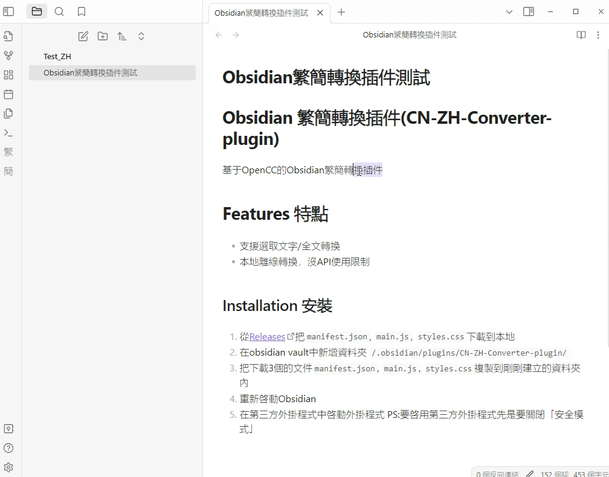
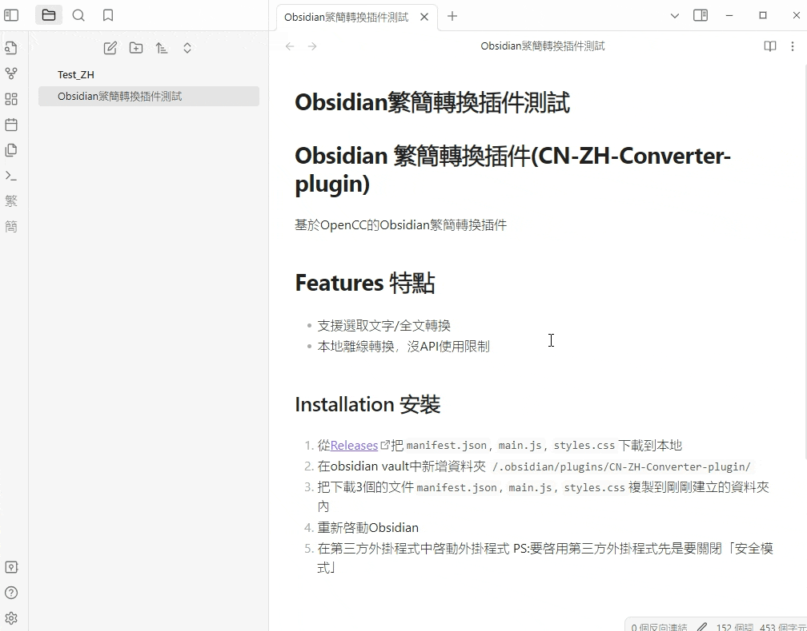

# Obsidian 繁簡轉換插件(chinese-cn2zh-converter-plugin)

基於OpenCC的Obsidian繁簡轉換插件

A Obsidian plugin to Convert between Simplified Chinese and Traditional Chinese 

## Features 特點
- 支援選取文字/全文轉換
- 本地離線轉換，沒API使用限制
- 可自訂轉換詞彙

## Installation 安裝
1. 從[Releases](https://github.com/s2031215/zh2cn-Converter-obsidian/releases)把`manifest.json`, `main.js`, `styles.css`下載到本地
2. 在obsidian vault中新增資料夾 `/.obsidian/plugins/chinese-cn2zh-converter-plugin/`
3. 把下載3個的文件`manifest.json`, `main.js`, `styles.css`複製到剛剛建立的資料夾內
4. 重新啟動Obsidian
5. 在第三方外掛程式中啟動外掛程式 

PS:要啟用第三方外掛程式請先關閉「安全模式」

## Usage 使用
### 1. 選取文字轉換

### 2. 全文轉換

## Build 編譯
1. 在obsidian vault中新增資料夾 `/.obsidian/plugins/chinese-cn2zh-converter-plugin/`
2. 在剛剛建立的資料夾內克隆(clone)本專案 `git clone https://github.com/s2031215/zh2cn-Converter-obsidian.git`
3. 在這個專案中執行 `npm install` 和 `npm run dev` 編譯插件
4. 重新啟動Obsidian，點選第三方套外掛程式，就可以看到你剛剛編譯的插件

## License 許可協議
[Apache License 2.0](LICENSE)

## Third Party Library 第三方庫
 - [OpenCC](https://github.com/BYVoid/OpenCC) Apache License 2.0
